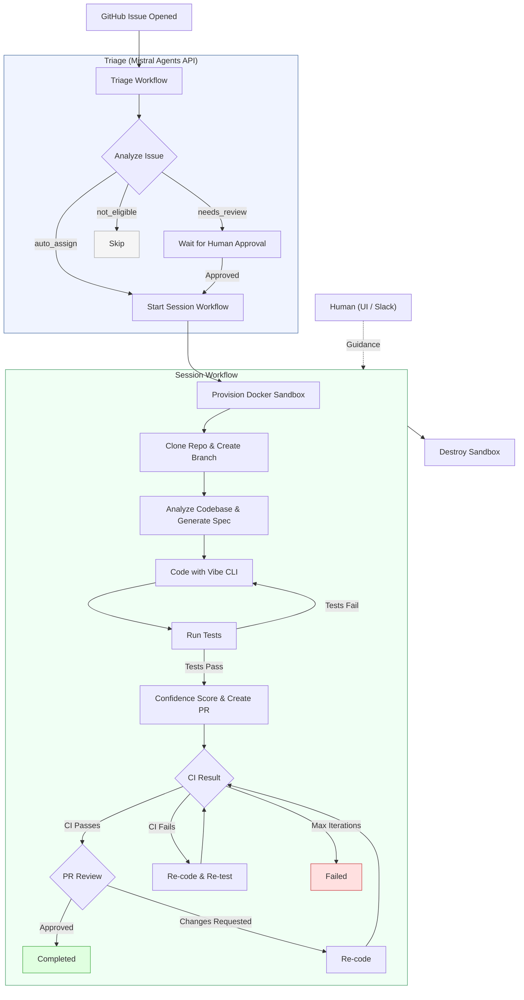

# Hydra - Autonomous Coding Agent

Hydra takes a GitHub issue, writes code to fix it, opens a PR, monitors CI, responds to review feedback, and iterates until done - all autonomously.

Built with **Mistral Vibe CLI** (code generation), **Mistral Workflows SDK** (orchestration via hosted Temporal), **Docker** (sandboxed execution), and **FastAPI** (API + UI).

## How It Works

### End-to-End Flow



### Two-Workflow Architecture

**Triage Workflow** - When a GitHub issue is opened, Mistral's Agents API analyzes it using function-calling tools (file tree browsing, code search, commit history). It decides whether to auto-assign the issue to Hydra, flag it for human review, or skip it.

**Session Workflow** - The main coding loop: provision sandbox, fetch issue, generate spec, code with Vibe CLI, run tests, create PR, monitor CI, handle review feedback, and iterate until done.

If the agent gets stuck, it escalates to a human via the UI or Slack. Humans can provide guidance, and the agent resumes.

### Sandbox Isolation

Each session runs in its own Docker container (`hydra-sandbox`). The repo is cloned, a branch is created, and Vibe CLI runs inside the container. Tests run via pytest. Changes are committed and pushed from within the container. The container is destroyed when the session ends.

### Confidence Scoring

Before opening a PR, Hydra analyzes its own diff and produces a 0-100 confidence score based on:
- Scope of changes (files touched, lines changed)
- Risk flags (auth files, CI config, migrations, credentials)
- Test coverage presence
- New dependencies introduced

## Quick Start

```bash
# Setup
python -m venv .venv && source .venv/bin/activate
pip install -e ".[dev]"
docker build -f Dockerfile.sandbox -t hydra-sandbox:latest .

# Configure .env
MISTRAL_API_KEY=...
GITHUB_TOKEN=...

# Run
python run.py
# Or: uvicorn app.main:app --reload --port 8000
```

UI: [http://localhost:8000/static/index.html](http://localhost:8000/static/index.html)

## Key Capabilities

| Capability | How |
|---|---|
| Code generation | Mistral Vibe CLI running in Docker sandbox |
| Issue triage | Mistral Agents API with function calling |
| Workflow orchestration | Mistral Workflows SDK (hosted Temporal) |
| CI monitoring | GitHub webhooks or polling script |
| PR review handling | Auto re-codes on change requests |
| Human-in-the-loop | UI/Slack escalation when stuck |
| Observability | Span-based tracing, metrics, SSE live events |

## API

| Endpoint | Purpose |
|---|---|
| `POST /api/sessions` | Start a new coding session |
| `GET /api/sessions/{id}` | Session status (merged with live workflow state) |
| `POST /api/sessions/{id}/signal/ci` | Send CI result |
| `POST /api/sessions/{id}/signal/review` | Send PR review feedback |
| `POST /api/sessions/{id}/assist` | Provide human guidance |
| `POST /api/sessions/{id}/cancel` | Cancel a session |
| `GET /api/sessions/{id}/events` | SSE event stream |
| `GET /api/sessions/{id}/trace` | Execution trace tree |
| `GET /api/metrics/summary` | Aggregate metrics |
| `POST /api/webhooks/github` | GitHub webhook receiver |

## Project Structure

```
app/
  main.py                  # FastAPI app + worker startup
  config.py                # Settings from .env
  models.py                # DB models (Session, Triage, Span, Metrics)
  workflows/
    hydra_session.py       # Session workflow (code -> PR -> CI -> review loop)
    triage.py              # Triage workflow (issue analysis)
    activities.py          # All side-effect functions (sandbox ops, GitHub, coding)
  api/
    sessions.py            # Session CRUD + signals
    webhooks.py            # GitHub webhook handler
    events.py              # SSE streaming
  integrations/
    github_client.py       # Async GitHub REST client
    slack_bot.py           # Slack slash commands
  sandbox/
    manager.py             # Docker container lifecycle + Vibe CLI execution
scripts/
  poll_github.py           # Polls GitHub for CI/reviews (webhook alternative)
static/                    # Vanilla HTML/JS UI
tests/                     # 82 tests across 11 files
```

## Tech Stack

- **Python 3.12**, **FastAPI**, **SQLAlchemy** (async SQLite)
- **Mistral Vibe CLI** - autonomous code editing
- **Mistral Agents API** - issue triage with function calling
- **Mistral Workflows SDK** - hosted Temporal orchestration
- **Docker SDK** - sandbox container management
- **httpx** - async HTTP client
- **Slack Bolt** - Slack integration

## Testing

```bash
pytest              # all tests
pytest -x -v        # stop on first failure
```

Tests use in-memory SQLite, mocked activities, and mocked workflow primitives. No Docker or external services needed.
